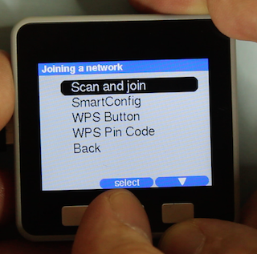
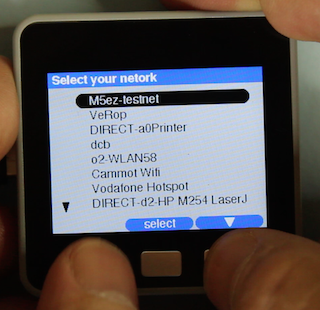
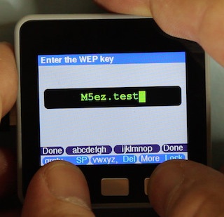
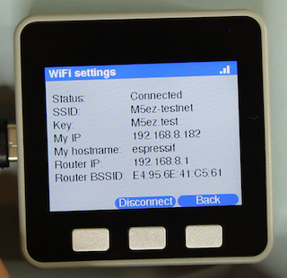

# `M5ez` The easy way to program on the M5Stack

>*M5ez (pronounced "M5 easy") is complete interface builder library for the M5Stack ESP32 system. It allows even novice programmers to create good looking interfaces. It comes with menus as text or as images, message boxes, very flexible button setup (including different length presses and multi-button functions), 3-button text input (you have to see it to believe it) and built-in Wifi support. Now you can concentrate on what your program does, and let M5ez worry about everything else.*

*written by Rop Gonggrijp*

[](https://www.youtube.com/watch?v=qRbE3FXEWJQ)

## introduction

The M5Stack is a small computer that is a tinkerer's dream. It is based on Espressiv's ESP32 chip (with WiFi and Bluetooth), it has a 320x240 pixel color screen, three buttons, a speaker, an SD slot and it allows you to stack boards below it, each in their own plastic enclosure. The makers sell boards for GSM, GPS and LoRa (Long Range radio) as well as a motor controller board and an empty experimenter board. The Chinese operation that makes them apears to sell a lot of them and I could get mine off of Amazon in a week. If you like to build things that you can hold in your hand and not just write code for yet another naked-looking board plugged into your USB port, this thing is your friend.

On the software side, the easiest way to program these is using the Arduino IDE. M5Stack provides a library which, when you include it, creates an m5 object instance that allows access to the various hardware components in the device. For instance: the display driver is accessible through commands all starting with `m5.lcd.`.

Making something that looks good and allows users to interact with it is not simple though: you have to program everything yourself. If you try to make something a little more complex, you quickly get bogged down in figuring out where things go on the display, what state your interface is in, etc etc.

In the budding M5Stack community, there have been some initiatives to make it easier to create user interfaces. Most notably a M5Stack forum user named Calin make something called "M5Stack MultiApp" which allows more easy integration of multiple existing programs into one app. His work serves as an inspiration for my work. But as much as you could have multiple programs have a common user interface, creating the programs still was nowhere near simple enough.

>This library and the documentation are all still very much a work in progress, but you have to publish something at some point. Please play with this and tell me what you like and don't like about it. 

## Getting started

M5ez is an Arduino library. Simply put the M5ez directory in your Arduino libraries directory, restart the IDE and start programming. You'll have your first application on the screen in no time. (Or start with one of the sketches below in the "Menus" section of the documentation, or the demo program from the video which is in the "Examples" directory of the library.

# M5ez Documentation

## The screen

**`void ez.clearScreen()`**

**`void ez.clearScreen(uint16_t bgcol)`**

M5ez has its own function to clear the screen that will also reset some of the M5ez things: it will reset the ez.print location to the top left, and it will change some internal state to reflect that you now have no header and no buttons on the display. M5ez calls this internally whenever your code runs a menu, displays a msgBox or does anything else where M5ez takes over the whole screen. After it is done (the menu runs one of your functions, msgBox exits, etc etc) it will call it again. You will only need to call this when your own code needs a clear screen after drawing something. Optionally you specify `bgcol` to blank the screen to another color than the current background color (see below), but this does not change the current background setting.

**`void ez.background(uint16_t color)`**

**`uint16_t ez.background()`**

When M5ez starts, the screen background is set to the default from the theme (a very light grey in the default theme). With `ez.background` You can specify a 16-bit color to become the new M5ez background color, or (with no arguments) read what the background is currently set to.

## The canvas

The "canvas" is M5ez's name for the area between the header and buttons. So if there are no header or no buttons, the canvas is the whole screen. Once they are drawn, the canvas becomes smaller.

**`void ez.clearCanvas()`**

Clears the canvas area to the current background color.

**`int16_t ez.canvasTop()`**

**`int16_t ez.canvasBottom()`**

**`int16_t ez.canvasLeft()`**

**`int16_t ez.canvasRight()`**

**`int16_t ez.canvasWidth()`**

**`int16_t ez.canvasHeight()`**

These other functions return canvas dimensions as their name implies. To be maximally flexible, your code should put its own stuff on te screen relative to `ez.canvasTop()` and make sure it is not heigher than `ez.canvasHeight()`. That way, if you decide to add or remove a header, your content will move accordingly.

The canvas is currently fixed at full width, meaning the left and right of the canvas are 0 and 319 respectively, but these functions return values already so that we can have vertical elements in the future.

The functions `ez.print` and `ez.println` (see below) are aware of the canvas and stop printing when they reach `ez.canvasBottom()`.

## The header

**`void ez.drawHeader(String header_txt)`**

**`void ez.removeHeader()`**

The header is the bar at the top of the screen. In the default theme it is 30 pixels high and blue, and it has text in font `&FreeSansBold9pt7b`, but all of that can be changed if you make your own theme. `ez.drawHeader` places the header, and `ez.removeHeader' removes it. Both change the canvas state accordingly.

In `ez.msgBox`, `ez.textInput`, when creating menus, or basically everywhere where you specify a header text, specifying the empty string will make that function not draw a header (and thus have more screen height available).

## Buttons

There are only three buttons on the M5Stack. To make sure we can make good use of our rare buttons, we can assign two functions to each button: one for a short press and one for a slightly longer press. We can also assign functions to all three combinations of two keys being pressed simultaneously (AB, BC and AC). So there is a total of nine possible key functions we can assign. The functions for a single key are displayed in the bottom row of the display, the functions for key combinations in a row above. Each key has a 'name' (which is also what is returned to the program if it is pressed and a 'caption', which is what is displayed on the key.


Because there are multiple functions that get told what buttons are going to be displayed, it would get a little hairy to give each of these function 18 possible arguments for the key names and captions. So for your convenience, all the keys you want displayed and detected are specified as one string. The different key names and captions are separated with hashes. You can specify one key name like `OK`, which means you will only use the middle button, it will say OK on it and it will also return the string "OK" to your code.

If you specify three keys, like `yes # no # maybe` you will get three buttons with only one function per button. If you specify six keys, they will be the short and long presses for each key. If you specify nine, the last three will specify the AB, BC and AC button-combi functions respectively. Specifying any other number of keys does not work, so the string should always contain one, three, six or nine parts, separated by hashes.


The captions on the key can differ from the name. To specify this, specify a name, followed by a pipe sign  (`|`) followed by the caption. So `one | un # two | deux # three | trois` specifies three keys that each show a number in french but return the number in english. Note that any spaces around the hashes or pipe signs in the string are ignored, to allow you to make things more readable in your code.

If your button is captioned `up`, `down`, `left` or `right`, the caption is replaced by a triangle pointing in that direction.

If a button has only one function, (no long press defined), the caption will be printed in the middle. If there is a short and a long press defined, they will be printed on the left and right, the right in cyan (in the default theme) to signify that it needs a longer press. 

*In some cases it may be necessary to define only a long or only a hort press action explicitly. In that case, defining a the key with the placeholder "~" will make sure its function is not interpreted. Take the key definition string `~ # up # select # # right # down`: this defines the leftmost key to have the 'up' funtion, but only with a long press, a short press is ignored. The caption prints on the right side of the button and not in the middle. (One might use this to signify that the user got to the left edge of something she's navigating, not causing the 'up' function to trigger when she keeps pressing short before realising she's at the left edge.)*

**`void ez.drawButtons(String buttons)`**

Draws all the buttons you specified, only redrawing the buttons that have changed from the buttons displayed already to prevent flicker. If needed it updates the canvas size to account for a changed number of keyboard rows displayed on the screen.

**`String ez.getButtons()`**

Then if you call `ez.getButtons`, it will return the name of the key pressed since you last called it, or the empty string is nothing was pressed.

**`String ez.waitForButtons()`**

 `ez.waitforButtons` does the same thing except it does not return if nothing is pressed. If you call it with no arguments, it assumes the buttons have already been drawn with `ez.drawButtons`. (And if not your program is stuck.) 
 
**`String ez.waitForButtons(String buttons)`**
  
You can specify the keys to be drawn straight into `ez.waitForButtons` for simple usages. For instance `ez.waitForButtons("OK")` will display a single "OK" on the center button and return "OK" when it is pressed. (But given that you are not interested in the return value in this case, you can just specify that as a statement.)

## Showing messages with msgBox


```
String ez.msgBox(String header,
	String msg, String buttons = "OK", 
    const bool blocking = true,
    const GFXfont* font = MSG_FONT,
    uint16_t color = MSG_COLOR)
```

`ez.msgBox` produces a screen that just has your text message centered in the middle. If your message consists of multiple lines, you have to indicate where to break the lines yourself with a pipe sign (`|`). msgBox will then make sure that these lines are horizontally and vertically centered. The only two arguments you have to provide are the header text and the message to be printed. If you do not specify buttons, `ez.msgBox` will put a single "OK" button in the middle. You can specify buttons in the same way it's done with the button commands seen earlier.


By default, msgBox then waits for the user to press any of the keys specified and returns the name of that key. If you want to scan for the keys yourself with `ez.getKeys()` (for instance because there are other things your code need to wait for or check) then you can specify `false` with blocking, msgBox will then show the message, header and buttons and exit.

The font and color options allow you to use something other than the default (theme determined) defaults for the message printed by msgBox. They act as you would expect, see the section on fonts and colors for details.

## 3-button text input

**`String ez.textInput(String header = "", String defaultText = "")`**

This function will provide a text-entry field, pre-filled with `defaulttext` if specified. The user can then select a group of letter and then press the letter using the short and long keypresses and multi-key presses as discussed above in the "Buttons" chapter. By using this method, the lower case letters can be reached in two presses, upper case letters in three. If you are in shifted or numeric mode and press lock, the keyboard will return there instead of to lower case after each sucessful key. Once the user presses "done" (buttons A and C together), the function returns the entered text.


>Advanced users can make their own keyboard definitions by looking at the `_keydefs` keyboard definition that is part of the default theme. As you can see there are multiple lines, each holding a key definition string like we have gotten to know them by now. Any key whose name is "KB" followed by a number causes nothing to be added to the input but the buttons in that line of the definitions to be printed instead. A key whose name is LCK: optionally followed by a string means that if it is pressed the current keyboard is what the user comes back to after a line is entered. Pressing a key whose name is "Back" returns to that keyboard as well. The string is used to denote the name of that keyboard in the on-screen capslock/numlock message.

## Printing text

```
void ez.print(String text,
	int16_t x = -1,
	int16_t y = -1,
	const GFXfont* font = NULL,
	uint16_t color = PRINT_DEFAULT_COL)
```

```
void println(String text,
	int16_t x = -1,
	int16_t y = -1,
	const GFXfont* font = NULL,
	uint16_t color = PRINT_DEFAULT_COL)
```

The `ez.print` and `ez.println` funtions behave much like the `m5.lcd.print` and `m5.lcd.println` functions from the M5Stack library: they print text at the current text position, in the case of `println` followed by a newline. But there are a few diferences. `ez.print` and `ez.println` have their own text location that is only used and updated by these two functions. This means you can print a few lines and then change the header text with `ez.drawHeader`, set new buttons with `ez.drawButtons` and then print the next line and it still ends up right underneath. You can specify an x and y position, which sets the new position for text to start from. If you specify a color and/or a font, they will only apply to this iteration of print. Any future iterations will still print in the default color and font.

If you pass -1 as x or y parameter (or don't supply them), print and println will start at the current position. That means you can only specify x if you want to 'tab' ahead without affecting the vertical position, or supply -1 as x and then supply an explicit y value for the same in the vertical direction.

**`void ez.printFont(const GFXfont* font)`**

**`void ez.printColor(uint16_t color)`**

These two set the default print font and color respectively. Work as you would expect.

**`void printLmargin(int16_t lmargin)`**

Sets a left margin (in pixels) for print to return to if a newline is printed. If you set it to something to the right of the current text position, the position moves to the new margin.

**`void printWrap(bool state)`**

Determines whether or not whether text printed by `ez.print` and `ez.println` wraps to the next line if it doesn't fit. By default it does.

## Fonts

**`void setFont(const GFXfont* font)`**

**`int16_t fontHeight()`**

Just like when using the `m5.lcd.setFreeFont` function directly, you can speciify the FreeFont fonts to `ez.setFont` with a pointer to where they are in flash. M5ez makes it possible to do the same but also use the built-in "pre-FreeFont" fonts that are available. Normally, you would have to pass these as a numeric parameter to `m5.lcd.setTextFont`. M5ez provides a set of "fake pointers" that are treated specially to make this happen, but they can only be passed to `ez.setFont`, not to any of the `m5.lcd` functions.

The fontHeight without arguments returns the height of the current font - FreeFont` or otherwise - in pixels, without needing to specify which text font like in the `m5.lcd` version.

What that means is that without adding any fonts of your own, you can specify the following fonts:

### FreeFonts from the Adafruit library

```
	&TomThumb
	&FreeMono9pt7b
	&FreeMono12pt7b
	&FreeMono18pt7b
	&FreeMono24pt7b
	&FreeMonoBold9pt7b
	&FreeMonoBold12pt7b
	&FreeMonoBold18pt7b
	&FreeMonoBold24pt7b
	&FreeMonoOblique9pt7b
	&FreeMonoOblique12pt7b
	&FreeMonoOblique18pt7b
	&FreeMonoOblique24pt7b
	&FreeMonoBoldOblique9pt7b
	&FreeMonoBoldOblique12pt7b
	&FreeMonoBoldOblique18pt7b
	&FreeMonoBoldOblique24pt7b
	&FreeSans9pt7b
	&FreeSans12pt7b
	&FreeSans18pt7b
	&FreeSans24pt7b
	&FreeSansBold9pt7b
	&FreeSansBold12pt7b
	&FreeSansBold18pt7b
	&FreeSansBold24pt7b
	&FreeSansOblique9pt7b
	&FreeSansOblique12pt7b
	&FreeSansOblique18pt7b
	&FreeSansOblique24pt7b
	&FreeSansBoldOblique9pt7b
	&FreeSansBoldOblique12pt7b
	&FreeSansBoldOblique18pt7b
	&FreeSansBoldOblique24pt7b
	&FreeSerif9pt7b
	&FreeSerif12pt7b
	&FreeSerif18pt7b
	&FreeSerif24pt7b
	&FreeSerifItalic9pt7b
	&FreeSerifItalic12pt7b
	&FreeSerifItalic18pt7b
	&FreeSerifItalic24pt7b
	&FreeSerifBold9pt7b
	&FreeSerifBold12pt7b
	&FreeSerifBold18pt7b
	&FreeSerifBold24pt7b
	&FreeSerifBoldItalic9pt7b
	&FreeSerifBoldItalic12pt7b
	&FreeSerifBoldItalic18pt7b
	&FreeSerifBoldItalic24pt7b
```
	
### FreeFonts included by the M5Stack driver

```
	&Orbitron_Light_24
	&Orbitron_Light_32
	&Roboto_Thin_24
	&Satisfy_24
	&Yellowtail_32
```

### older fonts available only through `ez.setFont`

```
	mono6x8
	sans16
	sans26
	numonly48
	numonly7seg48
	numonly75

	mono12x16
	sans32
	sans52
	numonly96
	numonly7seg96
	numonly150
```

Note that these fonts need to be specified without the `&` in front, and that the second batch consists of scaled up versions of the first batch, but they're nice and big and they still might be quite useful.

## Menus

Menus are a way of letting users choose between different options, usually to influence program flow. With ezMenu, you can create a menu, give it some options and run it for the user to choose. An ezMenu can display as a list of options, allowing the user to go up and down the list (possibly scrolling off the screen). Or it can be a set of full-screen (or really full-canvas) images, with the user scrolling left and right before chooing one. They are both instances of the ezMenu object


### Let's start with text menus

To create a menu we create an instance of the `ezMenu` object. By having each menu be it's own instance of that object, we can store information that will disappear from RAM if a submenu closes and we can return to higher menus which have kept their state. let's start with a complete sketch for a very simple text menu:

```
#include <M5Stack.h>
#include <M5ez.h>

void setup() {
  m5.begin();
}

void loop() {
  ezMenu myMenu;
  myMenu.addItem("Option 1", main_one);
  myMenu.addItem("Option 2", main_two);
  myMenu.addItem("Option 3");
  myMenu.run();  
}

void main_one() {
  ez.msgBox("", "You pressed one");
}

void main_two() {
  Serial.println("Number two was pressed");
}
```

As you can see we define our menu named `myMenu` and we added three items with names and optional functions to jump to. We have inserted this in the Arduino `loop` function, but we might as well have stuck it in setup, because this menu will keep running forever: the `myMenu.run()` statement will never complete. It will display the menu, call and wait for the appropriate function if the user selects a menu option, rinse and repeat.

Which is all fine and well if that's our main menu, but it doesn't work if if the menu is a submenu. This is why the `yourMenu.run()` function exits if the user selects a menu item named "Exit", "Back" or "Done". This may be with a capitalised first letter or all lower case. (Menu items are just like buttons in that they have a name and a caption. If you add an item with `yourMenu.addItem("Exit | Go back to main menu"), it will display the longer text, but still cause the menu to exit.

Let's see our sketch again, this time with a submenu added:

```
#include <M5Stack.h>
#include <M5ez.h>

void setup() {
  m5.begin(); 
}

void loop() {
  ezMenu myMenu("Main menu");
  myMenu.addItem("Item 1", main_one);
  myMenu.addItem("Item 2", main_two);
  myMenu.addItem("Item 3", main_three);
  myMenu.run();    
}

void main_one() {
  ez.msgBox("", "You pressed one");
}

void main_two() {
  Serial.println("Number two was pressed");
}

void main_three() {
  ezMenu subMenu("Submenu");
  subMenu.addItem("Item A");
  subMenu.addItem("Item B");
  subMenu.addItem("Item C");
  subMenu.addItem("Back | Back to main menu");
  subMenu.run();
}
```

As you can see, the submenu called `subMenu` has three items that do nothing because we did not supply functions, as well as a fourth item called "Back" (which displays "Back to main menu"), which, when selected, causes `subMenu.run()` to exit, which in turn causes `main_three` to exit which brings us back to the main menu. The main menu will sit there as if we never left, still showing "Item 3" highlighted. The subMenu object instance meanwhile has gone out of scope when the function exited, neatly cleaning up the RAM it used.

> Did you notice we're now providing brackets and an argument when we create the menu. That is the header above our menu.

### `.runOnce()`

Until now we have considered menus that run all by themselves, unless they exit when a user selects an option named "Back", "Exit" or "Done". But you can also call `yourMenu.runOnce()` which will exit every time a user selects an option (but still after executing the supplied function or functions). Take a look at this:

```
#include <M5Stack.h>
#include <M5ez.h>

void setup() {
  m5.begin(); 
}

void loop() {
  ezMenu myMenu("Main menu");
  myMenu.addItem("Item 1");
  myMenu.addItem("Item 2");
  myMenu.addItem("Item 3");
  myMenu.runOnce();
  if (myMenu.pickName() == "Item 1") {
  	ez.msgBox("", "You pressed one");
  }
  if (myMenu.pickName() == "Item 2") {
  	Serial.println("Number two was pressed");
  }   
}
```

This does exactly the same as the first example we started with. Note that `.runOnce()` returns an integer that holds the position of the item selected. So the following would be yet another way to get the same functionality:

```
#include <M5Stack.h>
#include <M5ez.h>

void setup() {
  m5.begin(); 
}

void loop() {
  ezMenu myMenu("Main menu");
  myMenu.addItem("Item 1");
  myMenu.addItem("Item 2");
  myMenu.addItem("Item 3");
  while (true) {
    switch (myMenu.runOnce()) {
      case 1:
        ez.msgBox("", "You pressed one");
        break;
      case 2:
        Serial.println("Number two was pressed");
        break;
    }
  }
}
```

### Image menus


You can include jpg files in the flash by creating a special .h file that holds byte arrays encoding the bytes in the JPG file. If you `#include` this file in your program and then add at least one menu items with `addItem(picture1, "Item 1")` where `picture1` is the name of the JPG array in the .h file, the menu's `.run()` and `.runOnce()` functions will change behaviour: they will show an image menu instead of a text menu.

The code in the demo application to show the picture menu looks as follows:

```
void main_image() {
  ezMenu images;
```

[...]

```
  images.addItem(sysinfo_jpg, "System Information", sysInfo);
  images.addItem(wifi_jpg, "WiFi Settings", main_wifi);
  images.addItem(about_jpg, "About M5ez", aboutM5ez);
  images.addItem(sleep_jpg, "Power Off", powerOff);
  images.addItem(return_jpg, "Back");
  images.run();
}
```

As you can see we simply call `addItem()` with the name of the byte array that holds the encoded JPG file, a name to be used as a caption on the image and a function to be executed.

### Menus: all the functions documented

As you will see in the function documentation below, there is much more you can do with menus, like adding and deleting items on the fly. And if you draw different buttons, it's important to know that any button not named "up" or "down" selects the currently highlighted item. You might, for instance, create a button or button combination named "info" that provides more information about the current selection. There is also an advanced function you can pass that has access to more data and that can cause the menu to exit.

**`ezMenu yourMenu(String header)`**

**`ezMenu yourMenu`**

If you issue on of these statements, you are creating an instance of the ezMenu object called "yourMenu". This will allow you to reference it when you start adding items to it, change various properties of it. Eventually your code will run the menu, which means it will display on the screen. "yourMenu" should ofcourse be replaced by any name of your choice, but we'll use it in this text to show all the functions that apply to menus. These funtions should be called with the name of the menu followed by a dot in front of them, as they are "member functions" of the ezMenu object.

```
bool addItem(String nameAndCaption, 
	void (*simpleFunction)() = NULL,
	bool (*advancedFunction)(ezMenu* callingMenu) = NULL)
```

```
bool addItem(const char *image, String nameAndCaption, 
	void (*simpleFunction)() = NULL,
	bool (*advancedFunction)(ezMenu* callingMenu) = NULL)
```

Adds items to a menu. The first form adds a text only item, the second form adds a pointer to the image that which is encoded as a byte array in a special .h file that you should have included. The `simpleFunction` should be the name of a `void` function without parameters that will simply be executed as the menu item is picked. You supply the name of the function **without the brackets** here, as you are passing a pointer to the function and not the output of it.

The string named `nameAndCaption` can (as the name implies) hold both a name and a caption. If you don't do anything special they are set to the same string you supply. But if you pass `somename | Some caption`, the name is the part before the first pipe sign (`|`), the caption is everything after it. (Spaced around the pipe sign are removed.)

The name is what is returned when you call `yourMenu.pickName()` after the menu has ran, and you can also supply it as an argument to `deleteItem()` (see below). The caption is what is printed, either in the item's line in the menu or as a caption with the image in an image menu. The caption is also returned by `yourMenu.pickCaption()`.   

If an item is named "Back", "Exit" or "Done" (either with first letter capitalised all all lower case), the menu will exit is this item is picked, unless an advancedFunction is supplied (see below). Note that while it has to be *named* one of these three things, it can be *captioned* something completely different.

If you want your code to have more access to what just happened in the menu, you can supply an advancedFunction pointer. This way you can have a function that has access to all the member functions of the menu that called it, and it can determine whether the memu exits or not by returning `true` (keep running) or `false` (exit). 

```
bool myAdvancedFunction(ezMenu* callingMenu) {
	Serial.print( callingMenu->pickCaption() )
	If (msgBox("Wow...", "Are you sure?", "yes##no") == "yes") return false;
	return true;
}
```

This function will print the caption printed on the menu item that was picked, and it will ask the user whether she really wants to exit the menu, causing the calling menu to exit by returning `false` if she presses yes. Note that items called "Back", "Exit" or "Done" do not cause the menu to exit immediately if they have an advancedFunction set: in that case the decision is left to the advancedFunction.

Note that to address member functions of the calling menu in this function we need to use '->' instead of '.'. That's because we were passed a pointer to the instance, not an instance itself, but don't worry too much if you don't understand that.

**`bool deleteItem(int16_t index)`**

**`bool deleteItem(String name)`**

The first form deletes the menu item at the position indicated, startng with 1 for the first menu item. The second form allows you to deltee a menu item by name. Note that this will only delete the first menu item with that name. `deleteItem` will return true if it works, false if the name or index do not point to a valid menu item.

**`int16_t getItemNum(String name)`**

Returns the index in the menu (starting at 1) of the first menu item with the specified name, or 0 if no item with that name exists.

**`void buttons(String bttns)`**

This allows you to pass your own buttons to the function, using the format discused in the chapter on buttons earlier in the documentation. By default, a text menu has the buttons `up # select # down` defined while an image menu has `left # select # right`. You can provide your own button layout, moving the buttons or adding functions for long presses or key combinations. Note that there is nothing special about the word "Select". Any button not named "up", "down", "left" or "right" is used to pick the current item, and you can use either an advancedFunction or `.runOnce()` and then a call to `.pickButton()` to figure out which key was pressed.

Buttons *captioned* "up", "down", "left" or "right" are displayed with a triangular arrow in the corresponding direction instead of that word. Buttons *named* "Back", "Exit" or "Done" cause the menu to exit. Note that menus without buttons named "up and "down" (text menus) or "left" and "right" (image menus) become impossible to navigate.

**`void txtFont(const GFXfont* font)`**

**`void txtBig()`**

**`void txtSmall()`**


These apply to text menus only. You can set the font. The theme can supply a default big and small menu font, which can be set by simply calling `.txtBig()` or `.txtSmall()` on a menu. In the default theme, the big menu can display 6 items at a time when a header and a single row of button labels is displayed, a small menu displays eight items at a time. You can set your own font with `txtFont` or create a new theme with different defaults.

<hr>

Then there are some functions that only apply to image menus 

**`void imgBackground(uint16_t color)`**

This sets a temporary background color different from the background from the theme or set manually with `ez.background`. This is so that background between the buttons can match the background of the images displayed. The background will retunr to its previous setting when the menu exits or runs supplied use functions.

**`void imgFromTop(int16_t offset)`**

The offset in pixels from `canvasTop()` where the top of the image is rendered.

**`void imgCaptionFont(const GFXfont* font)`**

**`void imgCaptionLocation(uint8_t datum)`**

**`void imgCaptionColor(uint16_t color)`**

**`void imgCaptionMargins(int16_t hmargin, int16_t vmargin)`**


These stting allow for the menu item caption to be printed somewhere on the canvas. The font and color options are obvious, the location is one of 

     | left | middle | right
:----|:-----|:-----|:------
**top** | `TL_DATUM` | `TC_DATUM` | `TR_DATUM`
**middle** | `ML_DATUM` | `MC_DATUM` | `MR_DATUM`
**right** | `BL_DATUM` | `BC_DATUM` | `BR_DATUM`

and the margins specify how far away from the edges of the canvas the caption is printed.


**`int16_t runOnce()`**

If you execute `yourMenu.runOnce()`, the menu will show and the user can interact with it until an item is picked. Then the function returns the index of the picked item (starting at one). The menu can also 'exit' (which is not the same as the `.runOnce()` function exiting, which happens when an item is picked.

* If the user picks an item named "Back", "Exit" or "Done" that does not have an advancedFunction passed. 
* If the user picks any item using a button named "Back", "Exit" or "Done".
* if the advancedFunction that was ran for a picked item returned `false`.

In all of the above cases, `.runOnce` will return 0. The index of the item picked will still be returned with `.pick()`, see below.

**`void run()`**

The internal code for `.run()` is very simple:

```
void ezMenu::run() {
	while (runOnce()) {}
}
```

In other words: all it does is just call `.runOnce()` on your menu until it exits for any of the reasons listed above. If your menu is the main menu of the program, you would simply not supply any items or buttons called "Exit", "Back" or "Done" and have no advancedFunctions ever return `false`. This will cause the menu to run forever. 

**`int16_t pick()`**

**`String pickName()`**

**`String pickCaption()`**

**`String pickButton()`**


These functions will show the position, name and caption of the picked item. They are useful after your menu has been ran once with `.runOnce` or in an advancedFunction (see under `addItem` above).

## Wifi

> If you read this, I am still working on the Wifi code. It works, but it's not like I want it yet.

If you call `ez.wifiStatus()`, you will see the current wifi status. You can use Join to connect. You can even enter your Wifi password on the device itself, how cool is that? Use the M5-demo program to see how it works. 










Known issue: it presently doesn't initialise right: you have to scan use "Scan & Join" before you can use SmartConfig, even if you let it fail. It does not keep settings when you reset.

Wifi settings will soon have a flash-stored list of access points it will automatically connect to, so the M5Stack behaves much more like you phone.

### The weird Wifi ghost button problem

When you connect to Wifi, you may notice a strange quirk of the M5Stack hardware, or possibly of the ESP32 chip. When you are connected, the left button is getting ghost clicks. If this happens to you when you are on Wifi, you will need to do the following to fix it.

Navigate to the Arduino libraries directory, and then from there to `M5Stack/src/utility/Button.cpp`. In that file (around line 60) find 

```
	pinVal = digitalRead(_pin);
```

and replace that line with:

```
// The digitalRead of the button pin is commented out below.
// The two lines below fix an issue where BtnA gets spurious presses if the
// Wifi is active. (The first line fixes it, the second remediates resulting 
// speaker noise.) For details: https://github.com/m5stack/M5Stack/issues/52

//    pinVal = digitalRead(_pin); 
    dacWrite(25, 0);							
    pinVal = analogRead(_pin);
```

Now recompile and the problemn is gone.

## Themes

If you look at the library file structure you will notice a directory called 'themes'. The file 'default.h' contains all sorts of interface defaults you can tinker with. Simply copy it to your sketch directory, rename it, change the values you want and include it before including M5ez itself. There will be more themes in the library's themes directory to choose from soon: if you make a pretty theme, let's include it in there for others to play with.

## Dual-use sketches

With a simple trick, you can make code that does something pretty on its own, but that can also be included to provide a submenu in a bigger program. If you look at the M5ez-demo program, you will see that its directory includes another sketch named sysinfo.ino. This is the same sysinfo.ino that can be compiled on its own. (It is in the Examples directory.) But if it is included with another program, the compiler will see that this other "master" program has specified `#define MAIN_DECLARED`. Since the sub program has `#ifndef MAIN_DECLARED` and `#endif` around its declarion of `setup()` and `loop()`, it no longer conflicts, and the "master" program can call functions from it. As you can see sysinfo.ino using the `#ifndef` further down to determine whether to provide an "Exit" button. After all: if it is running stand-alone there is nothing to exit to. Note that you do not need to include any sketches placed in the same directory as your master program: the compiler combines them automatically. That also means you must ensure that no names are declared twice, or otherwise the compiler will complain.