# `M5ez` The easy way to program on the M5Stack

>*M5ez (pronounced "M5 easy") is a complete interface builder library for the M5Stack ESP32 system. It allows even novice programmers to create good looking interfaces. It comes with menus as text or as images, message boxes, very flexible button setup (including different length presses and multi-button functions), 3-button text input (you have to see it to believe it) and built-in Wifi support. Now you can concentrate on what your program does, and let M5ez worry about everything else.*

*written by Rop Gonggrijp, with help and contributions from many others*

[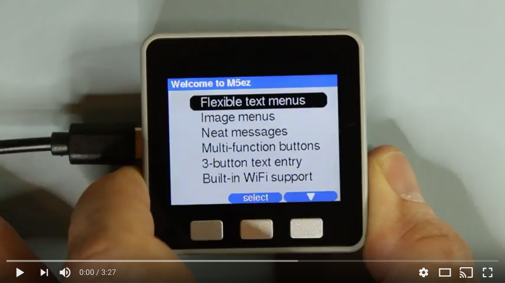](https://youtu.be/132gvdlwKZw)

## Introduction

The M5Stack is a small computer that is a tinkerer's dream. It is based on Espressif's ESP32 chip (with WiFi and Bluetooth), it has a 320x240 pixel color screen, three buttons, a speaker, an SD slot and it allows you to stack boards below it, each in their own plastic enclosure. The makers sell boards for GSM, GPS and LoRa (LOng RAnge radio) as well as a motor controller board and an empty experimenter board. The Chinese operation that makes them appears to sell a lot of them and I could get mine off of Amazon in a week. If you like to build things that you can hold in your hand and not just write code for yet another naked-looking board plugged into your USB port, this thing is your friend.

On the software side, the easiest way to program these is using the Arduino IDE. M5Stack provides a library which, when you include it, creates an m5 object instance that allows access to the various hardware components in the device. For instance: the display driver is accessible through commands all starting with `m5.lcd.`.

Making something that looks good and allows users to interact with it is not simple though: you have to program everything yourself. If you try to make something a little more complex, you quickly get bogged down in figuring out where things go on the display, what state your interface is in, etc etc.

In the budding M5Stack community, there have been some initiatives to make it easier to create user interfaces. Most notably a M5Stack forum user named Calin make something called "M5Stack MultiApp" which allows more easy integration of multiple existing programs into one app. His work serves as an inspiration for my work. But as much as you could have multiple programs have a common user interface, creating the programs still was nowhere near simple enough.

Enter M5ez, our contribution to making programming on the M5Stack *a lot* easier. We hope you'll enjoy programming with this.

### Other products by M5

M5 is not only making the M5stack anymore. There's now an M5Stick that is an even smaller ESP32 system with a smaller screen, there's the M5 Atom which has no screen and just LEDs, and soon there will be an M5stack Core2 which has a capacitive touch screen. We plan to support some of these devices, the stick support will be rolled out soon.

### Alternatives

#### UiFlow

Since writing M5ez, there has been another interface toolkit for the M5Stack, called UiFlow. It uses a web-and-cloud-based IDE that can be seen as "blocky" symbols or as python and creates micropython code. UiFlow supports a lot of the hardware sold in conjunction with the M5Stack and is very much geared towards learning and education.

That said, building the functionality that comes "packaged" with M5ez would take quite a bit of work with UiFlow. If you have existing things that run on Arduino, like programming in C and/or with the Arduino IDE, then M5ez might be the better choice. Also it is generally easier to create consistent and visually pleasing interfaces in M5ez, and complex things can take surprisingly little work.

&nbsp;

## Getting started

M5ez is an Arduino library. To start using it with the Arduino IDE:

* Choose Sketch -> Include Library -> Manage Libraries...
* Type **`M5ez`** into the search box.
* Click the row to select the library.
* Click the Install button to install the library.
* Repeat this process for the **`ezTime`** library

in File -> Examples you will now see an M5ez heading down under "Examples from custom libraries"

You'll have your first application on the screen in no time. You can also start with one of the sketches below in the "Menus" section of the documentation. In fact we strongly recommend that you play around with the M5ez demo application, since it is a comprehensive showcase of M5ez's functionality that will give you a good feel for what you can and cannot do with M5ez.

&nbsp;

### If you get `fatal error: ezTime.h: No such file or directory`

Note that it says above that you need to install two libraries: *M5ez* and *ezTime*.

> Alternatively, you can install M5ez without the time library (and without the on-screen clock), by commenting out `#define M5EZ_CLOCK` in file `m5ez.h` in the M5ez library directory.

&nbsp;

## Structure of documentation

You've now seen the [Introduction](https://github.com/ropg/M5ez#introduction) and [Getting Started](https://github.com/ropg/M5ez#getting-started) sections of the manual. Below is the [User Manual](https://github.com/ropg/M5ez#m5ez-user-manual) which lists all the functions of M5ez in detail. At the end there's a [Table of Contents](https://github.com/ropg/M5ez#table-of-contents) which may be of help finding something.

### Tech Notes

Separate from this document, there is a directory [tech_notes](https://github.com/ropg/M5ez/tree/master/tech_notes) where we keep useful technical notes that may be a bit too obscure or in-depth for a general user manual.

&nbsp;

# M5ez User Manual

M5ez is a complete system for building appliance-grade interfaces for the M5Stack. It comes with a lot of the common functionality built-in that a programmer would otherwise have to create. While it is very easy to create functional programs &mdash; just have a look at the examples that come with the library &mdash; the entire library can be a bit overwhelming because of how much it offers. The following is a reference for programmers that want to get the most out of M5ez. It is certainly not necessary to know or fully understand every function, but at some point you probably want to go through this document very quickly to see what M5ez can do for you.

If you feel anything is still unclear after reading this document, please file an issue in the repository. I take documentation seriously &mdash; if something is not clear in here, it is as much a bug as something that's wrong with the software itself. Pull requests for typos etc. gladly accepted.

&nbsp;

## How it all works

As you can see from the examples, the commands that activate M5ez's functionality start with `ez.`. That `ez` refers to an object `ez` that is within the "root namespace" of the sketch. Within it are commands like `ez.msgBox`, but also other objects. For instance: commands that deal with the entire screen are prefixed with `ez.screen.`, WiFi commands start with `ez.wifi.` and so forth.

After you include the library with `#include <M5ez.h>`, those objects all exist. To get things going you then &mdash; in the `void setup()` part of your sketch &mdash; do `ez.begin()`. This replaces `m5.begin`, which is called from within `ez.begin()`. You still need to `#include <M5Stack.h>` before `#include <M5ez.h>` if you want to use any commands from the m5 library in your sketch.

&nbsp;

## Screen

The screen object deals with the entire screen, which consists of an optional header at the top, optional buttons at the bottom and an area called "the canvas" in between.

`void ez.screen.clear()`

`void ez.screen.clear(uint16_t color)`

`uint16_t ez.screen.background()`

If you clear the screen, the header and buttons are hidden, the canvas is cleared, and the current background color is set to the color you specify, or to the background color from the current theme (`ez.theme->background`, see the chapter on themes) if you do not specify a color. `ez.screen.background()` will return the currently set background color.

If you clear the screen, the header and buttons are hidden, so the canvas takes up the entire screen.

&nbsp;

## Header

The header is the bar at the top of the screen. In the default theme it is 30 pixels high and blue, and it has text in font `&FreeSansBold9pt7b`, but all of that can be changed, either by modifying the values in the current theme on the fly or by creating your own theme.

### Showing, hiding, title

`void ez.header.show(String title = "")`

`void ez.header.title(String title = "")`

`bool ez.header.shown()`

`void ez.header.clear(bool wipe = true)`

`ez.header.show` will show the header, either with the present title or with a new one provided as an argument. `ez.header.title` will merely change the title, but will not change whether the header is displayed or not. `ez.header.shown()` returns true or false depending on whether the header is currently shown, and `ez.header.clear` removes the header, returning the top of the screen to the canvas. If you set `wipe` to false, it will not draw background pixels there. (This may help prevent flicker or add a bit of performance if you're about to clear the canvas anyway.)

### Your own header widgets

The clock and WiFi signal strength displayed in the M5ez header are "widgets". You can register your own code to display widgets too.

`void ez.header.insert(uint8_t position, String name, uint16_t width, void (*function)(uint16_t x, uint16_t w), bool leftover = false)`

`void ez.header.remove(String name)`

`uint8_t ez.header.position(String name)`

`void ez.header.draw(String name = "")`

`ez.header.insert` lets you add your own header widget. The header widget positions start at 0 (the leftmost widget), and `position` specifies t the left of which widget to insert the new one. `name` is just a name you use to refer to your widget. The names `title`, `clock` and `wifi` are reserved for use by M5ez.

Exactly one widget can be specified as `leftover`, meaning it gets all the pixels not claimed by any other widgets. By default, this is the widget called "title" that holds the header title. All other widgets must have a width in pixels specified.

`function` refers to the name of the function that draws your widget. It must be a function that returns nothing (`void`) and that takes two `uint16_t` arguments: the x position and width of your widget. This function will be called by the header code whenever the header is redrawn. But you can also force a redraw with `ez.header.draw`. For instance: the clock code calls for the `clock` widget to be redrawn every minute, for instance. Note that you would never call your widget draw function directly, because your code doesn't know where all the widgets are within the header. You would only ever call it indirectly using `ez.header.draw("your_widget_name")`, which will then see if the header is currently displayed, and if so lookup x position and width and call your draw function.

Your widget draw function has to make sure to stay inside the lines: not lower than `ez.theme->header_height`, not further left than x, not further right than x + w. If you want to be able to use your widget with multiple themes, your code should probably also respect `ez.theme->header_bgcolor` and `ez.theme->header_fgcolor` to make sure things look pretty.

`ez.header.position` will return the relative position of an existing header widget, starting with 0 for the leftmost widget, adding one for each further widget. This can be quite useful. For instance, if you want to make sure a widget is insert directly to the left of the title, you can specify `ez.header.insert(ez.header.position("title"), ...`. If you specify `(ez.header.position("title") + 1` your new widget gets inserted directly to the right of the title.

As the name implies, `ez.header.remove` removes the widget with the given name.

&nbsp;

## Canvas

The "canvas" is M5ez's name for the area between the header and buttons. So if there are no header and no buttons, the canvas is the whole screen. Once they are drawn, the canvas becomes smaller.

`void ez.canvas.clear()`

Clears the canvas area to the current background color &mdash; either the default from the theme or the one specified in the most recent `ez.screen.clear` command. Sets x and y positions for the the next print command to the top left (respecting the currently set left margin).

`void ez.canvas.reset()`

Reset does everything `ez.canvas.clear()` does, but also turns on text wrap, turns off scrolling, sets the print font and color back to the defaults from the theme and sets the left margin to 0.

### Canvas dimensions

Because the canvas size differs when header or buttons are shown, your code can ask for various locations and dimensions of the canvas as follows:

`uint8_t ez.canvas.top()`

`uint8_t ez.canvas.bottom()`

`uint16_t ez.canvas.left()`

`uint16_t ez.canvas.right()`

`uint8_t ez.canvas.height()`

`uint16_t ez.canvas.width()`

### Printing to the canvas

The M5ez canvas inherits from the Arduino `Print` object. What that means is that you can use the `print` and `println` functions in just the way you are used to using them. Here's all the different arguments taken by `printf`, `print` and `println`.

```
size_t ez.canvas.printf(const char * format, ...)  __attribute__ ((format (printf, 2, 3)));
size_t ez.canvas.print(const __FlashStringHelper *);
size_t ez.canvas.print(const String &);
size_t ez.canvas.print(const char[]);
size_t ez.canvas.print(char);
size_t ez.canvas.print(unsigned char, int = DEC);
size_t ez.canvas.print(int, int = DEC);
size_t ez.canvas.print(unsigned int, int = DEC);
size_t ez.canvas.print(long, int = DEC);
size_t ez.canvas.print(unsigned long, int = DEC);
size_t ez.canvas.print(double, int = 2);
size_t ez.canvas.print(const Printable&);
size_t ez.canvas.print(struct tm * timeinfo, const char * format = NULL);

size_t ez.canvas.println(const __FlashStringHelper *);
size_t ez.canvas.println(const String &s);
size_t ez.canvas.println(const char[]);
size_t ez.canvas.println(char);
size_t ez.canvas.println(unsigned char, int = DEC);
size_t ez.canvas.println(int, int = DEC);
size_t ez.canvas.println(unsigned int, int = DEC);
size_t ez.canvas.println(long, int = DEC);
size_t ez.canvas.println(unsigned long, int = DEC);
size_t ez.canvas.println(double, int = 2);
size_t ez.canvas.println(const Printable&);
size_t ez.canvas.println(struct tm * timeinfo, const char * format = NULL);
size_t ez.canvas.println(void);
```

`bool ez.canvas.scroll()`

`void ez.canvas.scroll(bool s)`

If you turn on scrolling with `ez.canvas.scroll(true)`, M5ez will store what has been printed to the screen, so the contents of the screen can scroll. Note that when the canvas starts scrolling, only the contents placed there with the print functions from above will scroll, everything else will be wiped. So if, for example, you have drawn something with `m5.lcs.fillRect`, it will be gone once you print beyond the last line.

You can turn scrolling off with `ez.canvas.scroll(false)`, and you can ask what the present scroll status is with `ez.canvas.scroll()`.

>Note on scrolling: for scrolling to work, everything that is printed to the screen is kept in memory. It is only forgotten if it scrolls off the screen or if you clear the canvas or screen. What that means is that if you turn scrolling on and then print and overwrite something lots of times, eventually the memory will fill up and your application will crash.

`bool ez.canvas.wrap()`

`void ez.canvas.wrap(bool w)`

`wrap` determines whether the excess from the print functions that doesn't fit the current line is wrapped to the next line.

`uint16_t ez.canvas.lmargin()`

`void ez.canvas.lmargin(uint16_t newmargin)`

Ask for and set the left margin for printing.

`void ez.canvas.font(const GFXfont* font)`

`const GFXfont* ez.canvas.font()`

`void ez.canvas.color(uint16_t color)`

`uint16_t ez.canvas.color()`

Ask for and set the font and color for printing.

`uint16_t ez.canvas.x()`

`void ez.canvas.x(uint16_t newx)`

`uint8_t ez.canvas.y()`

`void ez.canvas.y(uint8_t newy)`

`void pos(uint16_t x, uint8_t y)`

Ask for and set the x and y position for the next print command.

&nbsp;

## Buttons

There are only three buttons on the M5Stack. To make sure we can make good use of our rare buttons, we can assign two functions to each button: one for a short press and one for a slightly longer press. We can also assign functions to all three combinations of two keys being pressed simultaneously (AB, BC and AC). So there is a total of nine possible key functions we can assign. The functions for a single key are displayed in the bottom row of the display, the functions for key combinations in a row above. Each key has a 'name' (which is also what is returned to the program if it is pressed and a 'caption', which is what is displayed on the key.

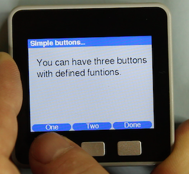

Because there are multiple functions that get told what buttons are going to be displayed, it would get a little hairy to give each of these function 18 possible arguments for the key names and captions. So for your convenience, all the keys you want displayed and detected are specified as one string. The different key names and captions are separated with hashes. You can specify one key name like `OK`, which means you will only use the middle button, it will say OK on it and it will also return the string "OK" to your code.

If you specify three keys, like `yes # no # maybe` you will get three buttons with only one function per button. If you specify six keys, they will be the short and long presses for each key. If you specify nine, the last three will specify the AB, BC and AC button-combo functions respectively. Specifying any other number of keys does not work, so the string should always contain one, three, six or nine parts, separated by hashes.

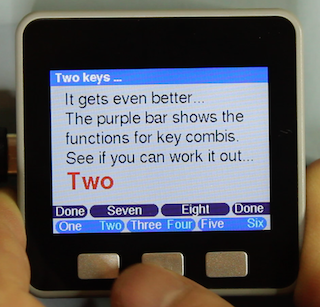

The captions on the key can differ from the name. To specify this, specify a name, followed by a pipe sign  (`|`) followed by the caption. So `one | un # two | deux # three | trois` specifies three keys that each show a number in french but return the number in english. Note that any spaces around the hashes or pipe signs in the string are ignored, to allow you to make things more readable in your code.

If your button is captioned `up`, `down`, `left` or `right`, the caption is replaced by a triangle pointing in that direction.

If a button has only one function, (no long press defined), the caption will be printed in the middle. If there is a short and a long press defined, they will be printed on the left and right, the right in cyan (in the default theme) to signify that it needs a longer press.

*In some cases it may be necessary to define only a long or only a short press action explicitly. In that case, defining a the key with the placeholder "~" will make sure its function is not interpreted. Take the key definition string `~ # up # select # # right # down`: this defines the leftmost key to have the 'up' function, but only with a long press, a short press is ignored. The caption prints on the right side of the button and not in the middle. (One might use this to signify that the user got to the left edge of something she's navigating, not causing the 'up' function to trigger when she keeps pressing short before realising she's at the left edge.)*

`void ez.buttons.show(String buttons)`

Shows all the buttons you specified, only redrawing the buttons that have changed from the buttons displayed already to prevent flicker. If needed it updates the canvas size to account for a changed number of keyboard rows displayed on the screen.

`void ez.buttons.clear(bool wipe = true)`

This hides the buttons, growing the canvas to cover the area where the buttons were printed. If you set `wipe` to false, it will not draw background pixels there. (This may help prevent flicker or add a bit of performance if you're about to clear the canvas anyway.)

`String ez.buttons.poll()`

If you call `ez.buttons.poll`, it will return the name of the key pressed since you last called it, or the empty string is nothing was pressed. This function is where everyone's M5ez programs will spends most of their time: waiting for the user to make things continue. If your code is waiting in a loop that includes `ez.buttons.poll`, clock and WiFi signal updating, as well as execution of user-registered functions (see below) will continue.

`String ez.buttons.wait()`

 `ez.buttons.wait` does the same thing as `ez.buttons.poll()` except it does not return if nothing is pressed. If you call it with no arguments, it assumes the buttons have already been drawn with `ez.drawButtons`. (And if not your program is stuck.)

`String ez.buttons.wait(String buttons)`

You can specify the keys to be drawn straight into `ez.buttons.wait` for simple usages. For instance `ez.buttons.wait("OK")` will display a single "OK" on the center button and return "OK" when it is pressed. (But given that you are not interested in the return value in this case, you can just specify that as a statement.)

&nbsp;

## Scheduling tasks within M5ez

Now that we're dealing with waiting for key presses, this is a good moment to talk about scheduling, yielding and such. As discussed above, a typical program written with M5ez will spend most of its time waiting for keys to be pressed. But some things need to continue to happen while that happening: the clock and the wifi signal indicator need to update, for instance.

### Yield

`void ez.yield()`

It could be that your code needs to do things that take a little while. If something takes many seconds, consider putting in an "abort" key. But suppose your code is busy and is not using `ez.buttons.poll` or `ez.buttons.wait` to check for keys. In that case use `ez.yield()` in your loop to make sure the clock and WiFi updating (as well as user defined tasks) get executed. `ez.yield` calls the Arduino `yield` function, so you do not need to call that separately.

### Your own events

`void ez.addEvent(uint16_t (*function)(), uint32_t when = 1)`

`void ez.removeEvent(uint16_t (*function)())`

With `addevent` you can register a function of your own to be executed periodically as part of M5ez's own loop when it is waiting for buttons. This function has to be a function that takes no arguments and returns a 16-bit unsigned integer. Make sure you just specify the name of this function without any brackets. You can optionally specify when to run this function by adding a time in `millis()`. By default, the function you specify will run immediately.

The value returned by your function is the number of milliseconds to wait before calling the function again. So a function that only needs to run once every second would simply return 1000. If your function returns 0, the event is deleted and not executed any further.

> Note: These events are meant for things that need to happen frequently. The next event cannot be more than 65 seconds out as the period between them is a 16-bit unsigned integer. If you use M5ez with ezTime, you can use [ezTime's events](https://github.com/ropg/ezTime#events) for things that need to happen with more time between them.

As the name implies, `ez.removeEvent` also removes your function from the loop.

#### Redrawing after an event

`void ez.redraw()`

Sometimes code executed in an event will have changed the contents of the screen. The running menu knows nothing about this, and so when your event ends, it will not refresh the screen. To fix this, you can execute `ez.redraw()` whenever your event routine has done something on the screen. The menu code will then redraw the screen accordingly.

&nbsp;

## Showing messages with msgBox


```
String ez.msgBox(String header,
  String msg, String buttons = "OK",
  const bool blocking = true,
  const GFXfont* font = MSG_FONT,
  uint16_t color = MSG_COLOR)
```

`ez.msgBox` produces a screen that just has your text message centered in the middle. If your message consists of multiple lines, msgBox will word-wrap and justify to the best fit on the screen. You can indicate where to break the lines yourself with a pipe sign (`|`). The only two arguments you have to provide are the header text and the message to be printed. If you do not specify buttons, `ez.msgBox` will put a single "OK" button in the middle. You can specify buttons in the same way it's done with the button commands seen earlier.

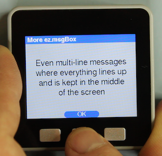

By default, msgBox then waits for the user to press any of the keys specified and returns the name of that key. If you want to scan for the keys yourself with `ez.buttons.poll()` (for instance because there are other things your code need to wait for or check) then you can specify `false` with blocking, msgBox will then show the message, header and buttons and exit.

The font and color options allow you to use something other than the default (theme determined) defaults for the message printed by msgBox. They act as you would expect, see the section on fonts and colors for details.

&nbsp;

## ezProgressBar

**`class ezProgressBar(String header = "", String msg = "", String buttons = "", const GFXfont* font = MSG_FONT, uint16_t color = MSG_COLOR, uint16_t bar_color = PROGRESSBAR_COLOR)`**

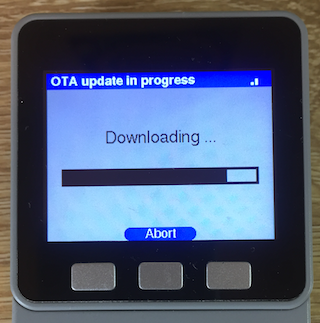

If you want to show progress on a download or something else, use the `ezProgressBar` class. It behaves very similarly to msgBox, except you need to create a class instance. To create an ezProgressBar instance called pb, one could use:

```
  ezProgressBar pb ("This is a header", "Message, just like with msgBox", "Abort");
```

This will draw header, message, an empty (0 %) progress bar and the specified single "Abort" button. Unlike msgBox this will not block by default. In code that executes after this, one would presumably check for the "Abort" button with `ez.buttons.poll()`. To advance the bar, the code would simply call:

```
  pb.value(float val)
```

where `val` is a floating point value between 0 and 100. Check out the [Over-The-Air https update example](https://github.com/ropg/M5ez/tree/master/examples/OTA_https) to see how the ezProgressBar object is used there. (You'll see that the `ez.wifi.update()` software update function accepts a pointer to an ezProgressBar instance to show its progress.)

&nbsp;

## 3-button text input

**`String ez.textInput(String header = "", String defaultText = "")`**

This function will provide a text-entry field, pre-filled with `defaultText` if specified. The user can then select a group of letter and then press the letter using the short and long keypresses and multi-key presses as discussed above in the "Buttons" chapter. By using this method, the lower case letters can be reached in two presses, upper case letters in three. If you are in shifted or numeric mode and press lock, the keyboard will return there instead of to lower case after each successful key. Once the user presses "done" (buttons A and C together), the function returns the entered text.

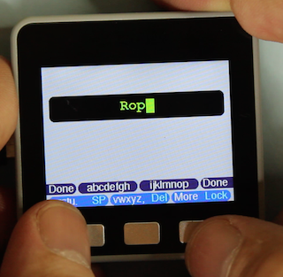

>Advanced users can make their own keyboard definitions by looking at the `_keydefs` keyboard definition that is part of the default theme. As you can see there are multiple lines, each holding a key definition string like we have gotten to know them by now. Any key whose name is "KB" followed by a number causes nothing to be added to the input but the buttons in that line of the definitions to be printed instead. A key whose name is LCK: optionally followed by a string means that if it is pressed the current keyboard is what the user comes back to after a line is entered. Pressing a key whose name is "Back" returns to that keyboard as well. The string is used to denote the name of that keyboard in the on-screen capslock/numlock message.

&nbsp;

## FACES keyboard support

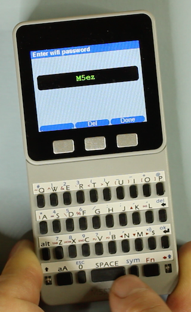

`String ez.faces.poll()`

`bool ez.faces.on()`

M5ez supports the M5 FACES keyboard: simply set the keyboard to "attached" in the M5ez settings menu. When you do, you will be able to use the `ez.faces.poll` function to get the last key pressed on the keyboard. The `textInput` and `textBox` functions will then also look for keys from that keyboard, and start with different key definitions for the M5Stack's own buttons. `ez.faces.on()` can be used to see if the keyboard is set to "attached" in the menu.

&nbsp;

## Composing or viewing longer texts: textBox

```
String ez.textBox(String header = "",
  String text = "", bool readonly = false,
  String buttons = "up#Done#down",
  const GFXfont* font = TB_FONT, uint16_t color = TB_COLOR)
```

This will word-wrap and display the string in `text` (up to 32 kB), allowing the user to page through it. Ideal for LoRa or SMS messages, short mails or whatever else. If a FACES keyboard is attached and `readonly` is false, the user can edit the text: a cursor appears, which can be moved with the arrow keys on the FACES keyboard. `TB_FONT` and `TB_COLOR` are the defaults from the theme, but they can be overridden by supplying a font and/or a color directly.

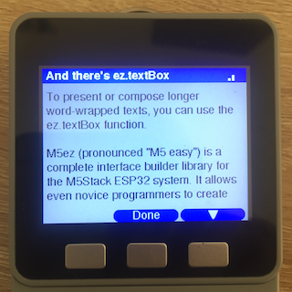

&nbsp;

## Fonts

**`void ez.setFont(const GFXfont* font)`**

**`int16_t ez.fontHeight()`**

Just like when using the `m5.lcd.setFreeFont` function directly, you can specify the FreeFont fonts to `ez.setFont` with a pointer to where they are in flash. M5ez makes it possible to do the same but also use the built-in "pre-FreeFont" fonts that are available. Normally, you would have to pass these as a numeric parameter to `m5.lcd.setTextFont`. M5ez provides a set of "fake pointers" that are treated specially to make this happen, but they can only be used by M5ez functions, not with any of the `m5.lcd` functions.

The fontHeight without arguments returns the height of the current font - FreeFont or otherwise - in pixels, without needing to specify which text font like in the `m5.lcd` version.

What that all means is that without adding any fonts of your own, you can specify the following fonts:

### FreeFonts from the Adafruit library

```
  &TomThumb
  &FreeMono9pt7b
  &FreeMono12pt7b
  &FreeMono18pt7b
  &FreeMono24pt7b
  &FreeMonoBold9pt7b
  &FreeMonoBold12pt7b
  &FreeMonoBold18pt7b
  &FreeMonoBold24pt7b
  &FreeMonoOblique9pt7b
  &FreeMonoOblique12pt7b
  &FreeMonoOblique18pt7b
  &FreeMonoOblique24pt7b
  &FreeMonoBoldOblique9pt7b
  &FreeMonoBoldOblique12pt7b
  &FreeMonoBoldOblique18pt7b
  &FreeMonoBoldOblique24pt7b
  &FreeSans9pt7b
  &FreeSans12pt7b
  &FreeSans18pt7b
  &FreeSans24pt7b
  &FreeSansBold9pt7b
  &FreeSansBold12pt7b
  &FreeSansBold18pt7b
  &FreeSansBold24pt7b
  &FreeSansOblique9pt7b
  &FreeSansOblique12pt7b
  &FreeSansOblique18pt7b
  &FreeSansOblique24pt7b
  &FreeSansBoldOblique9pt7b
  &FreeSansBoldOblique12pt7b
  &FreeSansBoldOblique18pt7b
  &FreeSansBoldOblique24pt7b
  &FreeSerif9pt7b
  &FreeSerif12pt7b
  &FreeSerif18pt7b
  &FreeSerif24pt7b
  &FreeSerifItalic9pt7b
  &FreeSerifItalic12pt7b
  &FreeSerifItalic18pt7b
  &FreeSerifItalic24pt7b
  &FreeSerifBold9pt7b
  &FreeSerifBold12pt7b
  &FreeSerifBold18pt7b
  &FreeSerifBold24pt7b
  &FreeSerifBoldItalic9pt7b
  &FreeSerifBoldItalic12pt7b
  &FreeSerifBoldItalic18pt7b
  &FreeSerifBoldItalic24pt7b
```

### FreeFonts included by the M5Stack driver

```
  &Orbitron_Light_24
  &Orbitron_Light_32
  &Roboto_Thin_24
  &Satisfy_24
  &Yellowtail_32
```

### Older fonts available only through M5ez

```
  mono6x8
  sans16
  sans26
  numonly48
  numonly7seg48
  numonly75

  mono12x16
  sans32
  sans52
  numonly96
  numonly7seg96
  numonly150
```

Note that these fonts need to be specified without the `&` in front, and that the second batch consists of scaled up versions of the first batch, but they're nice and big and they still might be quite useful.

### Using your own fonts

You can convert your own TrueType fonts to font files that can be included in your project and used on the M5Stack. As a separate project, I wrote a graphical converter where you can test the fonts on a virtual M5Stack display before converting. It's an online tool, so all of the action takes place online and in your web browser. Click [here](https://rop.nl/truetype2gfx/) (or on the image below) to use it. Everything you need to know to use it is on that page also.

[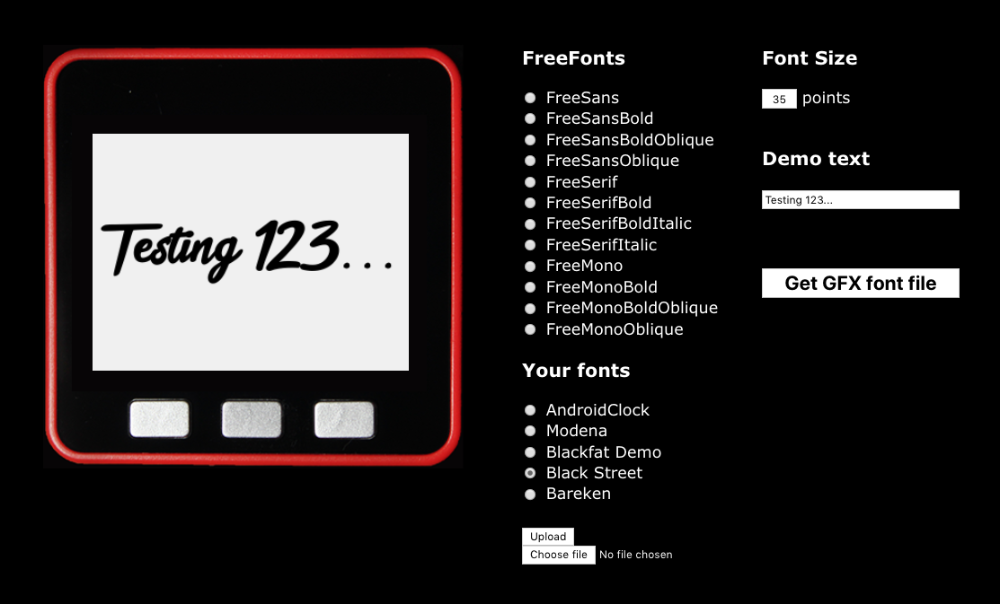](https://rop.nl/truetype2gfx/)

&nbsp;

## Menus

Menus are a way of letting users choose between different options, usually to influence program flow. With ezMenu, you can create a menu, give it some options and run it for the user to choose. An ezMenu can display as a list of options, allowing the user to go up and down the list (possibly scrolling off the screen). Or it can be a set of full-screen (or really full-canvas) images, with the user scrolling left and right before choosing one. They are both instances of the ezMenu object

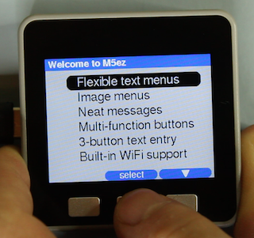

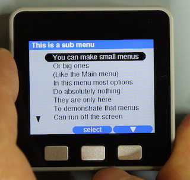


### Let's start with text menus

To create a menu we create an instance of the `ezMenu` object. By having each menu be it's own instance of that object, we can store information that will disappear from RAM if a submenu closes and we can return to higher menus which have kept their state. let's start with a complete sketch for a very simple text menu:

```
#include <M5Stack.h>
#include <M5ez.h>

void setup() {
  ez.begin();
}

void loop() {
  ezMenu myMenu;
  myMenu.addItem("Option 1", mainmenu_one);
  myMenu.addItem("Option 2", mainmenu_two);
  myMenu.addItem("Option 3");
  myMenu.run();  
}

void mainmenu_one() {
  ez.msgBox("", "You pressed one");
}

void mainmenu_two() {
  Serial.println("Number two was pressed");
}
```

As you can see we define our menu named `myMenu` and we added three items with names and optional functions to jump to. We have inserted this in the Arduino `loop` function, but we might as well have stuck it in setup, because this menu will keep running forever: the `myMenu.run()` statement will never complete. It will display the menu, call and wait for the appropriate function if the user selects a menu option, rinse and repeat.

Which is all fine and well if that's our main menu, but it doesn't work if if the menu is a submenu. This is why the `yourMenu.run()` function exits if the user selects a menu item named "Exit", "Back" or "Done". This may be with a capitalized first letter or all lower case. (Menu items are just like buttons in that they have a name and a caption. If you add an item with `yourMenu.addItem("Exit | Go back to main menu"), it will display the longer text, but still cause the menu to exit.

Let's see our sketch again, this time with a submenu added:

```
#include <M5Stack.h>
#include <M5ez.h>

void setup() {
  ez.begin();
}

void loop() {
  ezMenu myMenu("Main menu");
  myMenu.addItem("Item 1", mainmenu_one);
  myMenu.addItem("Item 2", mainmenu_two);
  myMenu.addItem("Item 3", mainmenu_three);
  myMenu.run();
}

void mainmenu_one() {
  ez.msgBox("", "You pressed one");
}

void mainmenu_two() {
  Serial.println("Number two was pressed");
}

void mainmenu_three() {
  ezMenu subMenu("Submenu");
  subMenu.addItem("Item A");
  subMenu.addItem("Item B");
  subMenu.addItem("Item C");
  subMenu.addItem("Back | Back to main menu");
  subMenu.run();
}
```

As you can see, the submenu called `subMenu` has three items that do nothing because we did not supply functions, as well as a fourth item called "Back" (which displays "Back to main menu"), which, when selected, causes `subMenu.run()` to exit, which in turn causes `mainmenu_three` to exit which brings us back to the main menu. The main menu will sit there as if we never left, still showing "Item 3" highlighted. The subMenu object instance meanwhile has gone out of scope when the function exited, neatly cleaning up the RAM it used.

> Did you notice we're now providing brackets and an argument when we create the menu. That is the header above our menu.

### `.runOnce()`

Until now we have considered menus that run all by themselves, unless they exit when a user selects an option named "Back", "Exit" or "Done". But you can also call `yourMenu.runOnce()` which will exit every time a user selects an option (but still after executing the supplied function or functions). Take a look at this:

```
#include <M5Stack.h>
#include <M5ez.h>

void setup() {
  ez.begin();
}

void loop() {
  ezMenu myMenu("Main menu");
  myMenu.addItem("Item 1");
  myMenu.addItem("Item 2");
  myMenu.addItem("Item 3");
  myMenu.runOnce();
  if (myMenu.pickName() == "Item 1") {
    ez.msgBox("", "You pressed one");
  }
  if (myMenu.pickName() == "Item 2") {
    Serial.println("Number two was pressed");
  }
}
```

This does exactly the same as the first example we started with. Note that `.runOnce()` returns an integer that holds the position of the item selected. So the following would be yet another way to get the same functionality:

```
#include <M5Stack.h>
#include <M5ez.h>

void setup() {
  ez.begin();
}

void loop() {
  ezMenu myMenu("Main menu");
  myMenu.addItem("Item 1");
  myMenu.addItem("Item 2");
  myMenu.addItem("Item 3");
  while (true) {
    switch (myMenu.runOnce()) {
      case 1:
        ez.msgBox("", "You pressed one");
        break;
      case 2:
        Serial.println("Number two was pressed");
        break;
    }
  }
}
```

### Image menus


You can include jpg files in the flash by creating a special .h file that holds byte arrays encoding the bytes in the JPG file. If you `#include` this file in your program and then add at least one menu items with `addItem(picture1, "Item 1")` where `picture1` is the name of the JPG array in the .h file, the menu's `.run()` and `.runOnce()` functions will change behavior: they will show an image menu instead of a text menu.

You can also include the images to be shown as files, either on an SD card or on the special SPIFFS partition in the flash memory of the M5Stack.

The code in the demo application to show the picture menu looks as follows:

```
void mainmenu_image() {
  ezMenu images;

  ...

  images.addItem(sysinfo_jpg, "System Information", sysInfo);
  images.addItem(wifi_jpg, "WiFi Settings", mainmenu_wifi);
  images.addItem(about_jpg, "About M5ez", aboutM5ez);
  images.addItem(sleep_jpg, "Power Off", powerOff);
  images.addItem(return_jpg, "Back");
  images.run();
}
```

As you can see we simply call `addItem()` with the name of the byte array that holds the encoded JPG file, a name to be used as a caption on the image and a function to be executed.

### Menus: all the functions documented

As you will see in the function documentation below, there is much more you can do with menus, like adding and deleting items on the fly. And if you draw different buttons, it's important to know that any button not named "up" or "down" selects the currently highlighted item. You might, for instance, create a button or button combination named "info" that provides more information about the current selection. There is also an advanced function you can pass that has access to more data and that can cause the menu to exit.

**`ezMenu yourMenu(String header)`**

**`ezMenu yourMenu`**

If you issue on of these statements, you are creating an instance of the ezMenu object called "yourMenu". This will allow you to reference it when you start adding items to it, change various properties of it. Eventually your code will run the menu, which means it will display on the screen. "yourMenu" should of course be replaced by any name of your choice, but we'll use it in this text to show all the functions that apply to menus. These functions should be called with the name of the menu followed by a dot in front of them, as they are "member functions" of the ezMenu object.

```
bool addItem(String nameAndCaption,
  void (*simpleFunction)() = NULL,
  bool (*advancedFunction)(ezMenu* callingMenu) = NULL,
  void (*drawFunction)(ezMenu* callingMenu, int16_t x, int16_t y, int16_t w, int16_t h) = NULL)
```

```
bool addItem(const char *image, String nameAndCaption,
  void (*simpleFunction)() = NULL,
  bool (*advancedFunction)(ezMenu* callingMenu) = NULL,
  void (*drawFunction)(ezMenu* callingMenu, int16_t x, int16_t y, int16_t w, int16_t h) = NULL)
```

```
bool addItem(fs::FS &fs, String path, String nameAndCaption,
  void (*simpleFunction)() = NULL,
  bool (*advancedFunction)(ezMenu* callingMenu) = NULL,
  void (*drawFunction)(ezMenu* callingMenu, int16_t x, int16_t y, int16_t w, int16_t h) = NULL)
```

Adds items to a menu. The first form adds a text only item, the second and third forms make image menus. You can either supply a pointer to the image which is encoded as a byte array in a special .h file that you should have included, or a file system reference and a path for a file stored on SD of SPIFFS.

In the latter case your sketch must do either `#include <SPIFFS.h>` and `SPIFFS.begin()` or `#include <SD.h>' and 'SD.begin()`, and provide both the SD or SPIFFS object reference as well as the path to the file. The "ImagesSPIFFSorSD" example shows how to use this feature. Images from program flash, SPIFFS and SD-card can be freely mixed in the same menu.

The `simpleFunction` should be the name of a `void` function without parameters that will simply be executed as the menu item is picked. You supply the name of the function **without the brackets** here, as you are passing a pointer to the function and not the output of it.

The string named `nameAndCaption` can (as the name implies) hold both a name and a caption. If you don't do anything special they are set to the same string you supply. But if you pass `somename | Some caption`, the name is the part before the first pipe sign (`|`), the caption is everything after it. (Spaced around the pipe sign are removed.)

The name is what is returned when you call `yourMenu.pickName()` after the menu has ran, and you can also supply it as an argument to `deleteItem()` (see below). The caption is what is printed, either in the item's line in the menu or as a caption with the image in an image menu. The caption is also returned by `yourMenu.pickCaption()`.

If you put a tab character (Represented by `\t`) in the caption of a menu item, the text to the left of the tab will be left-aligned to the left of the menu item, and the text to the right of it will be right-aligned to the right of the item. You can see this feature in use in M5ez's settings menu where the part on the right generally represents the actual state of a setting.

If an item is named "Back", "Exit" or "Done" (either with first letter capitalized all all lower case), the menu will exit is this item is picked, unless an advancedFunction is supplied (see below). Note that while it has to be *named* one of these three things, it can be *captioned* something completely different.

If you want your code to have more access to what just happened in the menu, you can supply an advancedFunction pointer. This way you can have a function that has access to all the member functions of the menu that called it, and it can determine whether the menu exits or not by returning `true` (keep running) or `false` (exit).

```
bool myAdvancedFunction(ezMenu* callingMenu) {
  Serial.print( callingMenu->pickCaption() )
  If (msgBox("Wow...", "Are you sure?", "yes##no") == "yes") return false;
  return true;
}
```

This function will print the caption printed on the menu item that was picked, and it will ask the user whether she really wants to exit the menu, causing the calling menu to exit by returning `false` if she presses yes. Note that items called "Back", "Exit" or "Done" do not cause the menu to exit immediately if they have an advancedFunction set: in that case the decision is left to the advancedFunction.

If you want your code to have access to the way the menus are drawn, you can supply an drawFunction pointer. The coordinates x, y, w (width) and h (height) define the rectangle where the menu is located.

```
void myDrawFunction(ezMenu* callingMenu, int16_t x, int16_t y, int16_t w, int16_t h){
  m5.lcd.setTextDatum(CL_DATUM);
  m5.lcd.setTextColor(ez.theme->menu_item_color);
  // New callingMenu aspect
  m5.lcd.fillRoundRect(x, y, w, h, 1, TFT_RED);
  m5.lcd.drawString("New text",x + ez.theme->menu_item_hmargin,y + ez.fontHeight() / 2 - 2);
}
```

Note that to address member functions of the calling menu in this function we need to use '->' instead of '.'. That's because we were passed a pointer to the instance, not an instance itself, but don't worry too much if you don't understand that.

**`bool deleteItem(int16_t index)`**

**`bool deleteItem(String name)`**

The first form deletes the menu item at the position indicated, starting with 1 for the first menu item. The second form allows you to delete a menu item by name. Note that this will only delete the first menu item with that name. `deleteItem` will return true if it works, false if the name or index do not point to a valid menu item.

**`bool setCaption(int16_t index, String caption)`**

**`bool setCaption(String name, String caption)`**

As the name implies, changes the caption (but not the name) of the item specified either by position or by name.

**`int16_t getItemNum(String name)`**

Returns the index in the menu (starting at 1) of the first menu item with the specified name, or 0 if no item with that name exists.

**`void buttons(String bttns)`**

This allows you to pass your own buttons to the function, using the format discussed in the chapter on buttons earlier in the documentation. By default, a text menu has the buttons `up # select # down` defined while an image menu has `left # select # right`. You can provide your own button layout, moving the buttons or adding functions for long presses or key combinations. Note that there is nothing special about the word "Select". Any button not named "up", "down", "left" or "right" is used to pick the current item, and you can use either an advancedFunction or `.runOnce()` and then a call to `.pickButton()` to figure out which key was pressed.

Buttons *captioned* "up", "down", "left" or "right" are displayed with a triangular arrow in the corresponding direction instead of that word. Buttons *named* "Back", "Exit" or "Done" cause the menu to exit. Note that menus without buttons named "up and "down" (text menus) or "left" and "right" (image menus) become impossible to navigate.

Buttons named "first" and "last" ump to the first or last item of the menu respectively.

**`void upOnFirst(String nameAndCaption)`**

**`void leftOnFirst(String nameAndCaption)`**

**`void downOnLast(String nameAndCaption)`**

**`void rightOnLast(String nameAndCaption)`**

These functions allow you to replace the navigation button that would navigate off the menu with something else. Normally this button would just disappear. You can make menu rotate (like the main menu in the demo app) like this:

```
  main.upOnFirst("last|up");
  main.downOnLast("first|down");
```

Note that the "first" and "last" are button *names* with special functions, and "up" and "down" are *captions* with special functions (they are replaced by triangle arrows). The first two and last two functions are actually synonyms: they do they same thing, it's just clearer to use the second form when creating an image menu (which is horizontal).

**`void txtFont(const GFXfont* font)`**

**`void txtBig()`**

**`void txtSmall()`**

These apply to text menus only. You can set the font. The theme can supply a default big and small menu font, which can be set by simply calling `.txtBig()` or `.txtSmall()` on a menu. In the default theme, the big menu can display 6 items at a time when a header and a single row of button labels is displayed, a small menu displays eight items at a time. You can set your own font with `txtFont` or create a new theme with different defaults.

---

Then there are some functions that only apply to image menus

**`void imgBackground(uint16_t color)`**

This sets a temporary background color different from the background from the theme or set manually with `ez.background`. This is so that background between the buttons can match the background of the images displayed. The background will return to its previous setting when the menu exits or runs any of the functions supplied with `addItem`.

**`void imgFromTop(int16_t offset)`**

The offset in pixels from `canvasTop()` where the top of the image is rendered.

**`void imgCaptionFont(const GFXfont* font)`**

**`void imgCaptionLocation(uint8_t datum)`**

**`void imgCaptionColor(uint16_t color)`**

**`void imgCaptionMargins(int16_t hmargin, int16_t vmargin)`**

These settings allow for the menu item caption to be printed somewhere on the canvas. The font and color options are obvious, the location is one of

|     | left | middle | right |
| ----|:-----|:-----|:------ |
| **top** | `TL_DATUM` | `TC_DATUM` | `TR_DATUM` |
| **middle** | `ML_DATUM` | `MC_DATUM` | `MR_DATUM` |
| **bottom** | `BL_DATUM` | `BC_DATUM` | `BR_DATUM` |

and the margins specify how far away from the edges of the canvas the caption is printed. The default is for no caption to be printed, you must specify all these options if you want captions.

**`int16_t runOnce()`**

If you execute `yourMenu.runOnce()`, the menu will show and the user can interact with it until an item is picked. Then the function returns the index of the picked item (starting at one). The menu can also 'exit' (which is not the same as the `.runOnce()` function exiting, which happens when an item is picked.

* If the user picks an item named "Back", "Exit" or "Done" that does not have an advancedFunction passed.
* If the user picks any item using a button named "Back", "Exit" or "Done".
* if the advancedFunction that was ran for a picked item returned `false`.

In all of the above cases, `.runOnce` will return 0. The index of the item picked will still be returned with `.pick()`, see below.

**`void run()`**

The internal code for `.run()` is very simple:

```
void ezMenu::run() {
  while (runOnce()) {}
}
```

In other words: all it does is just call `.runOnce()` on your menu until it exits for any of the reasons listed above. If your menu is the main menu of the program, you would simply not supply any items or buttons called "Exit", "Back" or "Done" and have no advancedFunctions ever return `false`. This will cause the menu to run forever.

**`int16_t pick()`**

**`String pickName()`**

**`String pickCaption()`**

**`String pickButton()`**

These functions will show the position, name and caption of the picked item. They are useful after your menu has been ran once with `.runOnce` or in an advancedFunction (see under `addItem` above).

&nbsp;

## Settings

M5ez comes with a number of built-in settings menus. The settings are saved to flash in the `M5ez` section of the ESP32 NVS facility (using the Arduino `Preferences` library). All you need to do is create one menu item that points to `ez.settings.menu` and all settings will be available. By commenting out certain compiler defines, menu items (and all code associated with them) can be disabled. The various menus can also be accessed directly. Here's a quick table of the menus, their `#define` keyword, and their direct access function.

| Menu | `#define` | function |
|:-----|:----------|:---------|
| Wifi menu | `M5EZ_WIFI` | `ez.wifi.menu` |
| Battery menu | `M5EZ_BATTERY` | `ez.battery.menu` |
| Clock menu | `M5EZ_CLOCK` | `ez.clock.menu` |
| Backlight brightness | `M5EZ_BACKLIGHT` | `ez.backlight.menu` |
| FACES keyboard | `M5EZ_FACES` | `ez.faces.menu` |
| Theme chooser | n/a | `ez.theme.menu` |

### Wifi

The wifi menu allows the user to connect to an Access Point. The user can also turn on and off the "autoconnect" feature. With this feature on, M5EZ will behave like most smartphones and automatically connect to any Access Point which has been added to the autoconnect list when it was joined.

Note that this doesn't use the `WiFi.setAutoConnect` and `WiFi.setAutoReconnect` functions of the ESP32 WiFi library: they can only connect to one access point. Instead  M5ez has it's own logic for connecting, saving the ssid and password of networks you want to automatically connect to in flash.

Below you can see how to access the stored networks as well as the stored "on/off" toggle for the autoconnect feature from code. You probably won't need this as `ez.wifi.menu` lets the user manage all of this. Note that if you do make any changes, you have to call `ez.wifi.writeFlash()` when you are done to save them to flash.

`std::vector<WifiNetwork_t> networks`

`ez.wifi.networks` is a vector (think of it as an array), that holds all the stored networks after M5ez boots (or `ez.wifi.readFlash()` is executed). Here's a code example to print all the SSIDs and their passwords to the M5ez canvas.

```
for (int8_t n = 0; n < ez.wifi.networks.size(); n++) {
  ez.canvas.print(ez.wifi.networks[n].SSID);
  ez.canvas.print(": ");
  ez.canvas.println(ez.wifi.networks[n].key);
}
```

`void ez.wifi.add(String ssid, String key)`

`bool ez.wifi.remove(int8_t index)`

`bool ez.wifi.remove(String ssid)`

Adds or removes a network. the index is the index in te networks array above.

`int8_t indexForSSID(String ssid)`

Can be used to find the index for a named SSID. -1 is returned if the name is not found.

#### The weird Wifi ghost button problem

when you connect to Wifi, on some M5Stack devices, you may notice a strange quirk of the M5Stack hardware, or possibly of the ESP32 chip. When you are connected, the left button is getting ghost clicks. If this happens to you when you are on Wifi, you will need to do the following to fix it.

Navigate to the Arduino libraries directory, and then from there to `M5Stack/src/utility/Button.cpp`. In that file (around line 60) find

```
  pinVal = digitalRead(_pin);
```

and replace that line with:

```
// The digitalRead of the button pin is commented out below.
// The two lines below fix an issue where BtnA gets spurious presses if the
// Wifi is active. (The second line fixes it, the first remediates resulting
// speaker noise.) For details: https://github.com/m5stack/M5Stack/issues/52

//    pinVal = digitalRead(_pin);
    dacWrite(25, 0);
    pinVal = analogRead(_pin);
```

Now recompile and the problem is gone. It does mean that you cannot use the speaker while  `ez.buttons.poll()` is checking for button presses.

#### Over-The-Air (OTA) updates via https

You might deploy hardware that needs updates but that you don't want to hook up via USB every time. But you will want this upload mechanism to offer some security against attackers that could otherwise compromise large numbers of internet-connected IoT devices. M5ez allows you to boot from a compiled binary file that is downloaded from the internet over https.

`bool ez.wifi.update(String url, const char* root_cert, ezProgressBar* pb = NULL)`

`String ez.wifi.updateError()`

Takes a URL and a root certificate. A shell script called `get_cert` is provided in the `/tools` directory of this repository to get the right (non-forwarded) URL and create an include file to provide the correct certificate. The optional third argument is a pointer to the `ezProgressBar` instance that will show the progress of the firmware download. It must be provided with a leading ampersand.

`ez.wifi.update` returns `true` if the file is downloaded and everything is set up. The next reboot - which can be forced with `ESP.restart()` - will start the new binary. If `ez.wifi.update` returns `false`, you can use `ez.wifi.updateError()` to return a String with a human-readable error message. (The way the https stream data is handled by the underlying ESP32 `Update` library does not seem terribly robust: stream timeouts happen, even on otherwise good internet connections.)

The [README.rd file of the OTA_https sample sketch](https://github.com/ropg/M5ez/tree/master/examples/OTA_https) provides a step-by-step recipe that describes how to determine the URL and get the certificate using `get_cert`.

&nbsp;

### BLE

BLE, short for [Bluetooth Low Energy](https://en.wikipedia.org/wiki/Bluetooth_Low_Energy).  Is intended to provide considerably reduced power consumption and cost while maintaining a similar communication range. We implemented a device manager, so you can just focus on communicate with the target device. You can access it's interface from `ez.ble` , and can get access to connected devices from `ez.ble.getClient` function.

&nbsp;

### Battery

The battery menu allows you to selectively show a battery level icon in the header bar. But due to [hardware limitations](https://github.com/m5stack/M5Stack/issues/74) it can only show four different battery levels. You can access its menu from `ez.battery.menu`.

&nbsp;

### Clock

If M5ez is compiled with M5EZ_CLOCK (which it is by default), it will be set up to display a clock in the header bar at the top of the screen. By default this clock displays time in a 24 hour format, but this can be changed in the clock menu, which is also accessible directly via `ez.clock.menu`.

The first time M5ez goes online, it will try to look up the timezone using the GeoIP country of the IP address you are connecting to the timezone server from. If this lookup fails or if you are in a country that spans multiple timezones this lookup will fail and an official timezone name will have to be set manually in the menu. (Timezone names are of the from `Continent/Some_City`, see [here](https://en.wikipedia.org/wiki/List_of_tz_database_time_zones) for a list of timezone names. Note that the name of the timezone has to be entered in the correct case.

If you use M5ez with on-screen clock, your code can also use all the other features of [ezTime](https:://github.com.ropg/ezTime), my full-featured general purpose Arduino time library.

&nbsp;

### Backlight

You can set the brightness of the LCD backlight LEDs here. The menu is also directly accessible via `ez.backlight.menu`.

&nbsp;

### FACES keyboard

Here you can set whether or not you have a FACES keyboard attached. I would have preferred to detect the keyboard automatically, but that's not easy, so it's solved with a settings menu.

&nbsp;

### Factory defaults

This will erase M5ez's NVS flash section and boot, setting all M5ez settings back to their defaults.

&nbsp;

### Adding your own settings

You can add your own settings menu. The settings menu object `ez.settings.menuObj` is a regular M5ez menu, and so your own code can, at startup, add its own submenus. To show how, let's see a snippet of M5ez's own code

```
ez.settings.menuObj.addItem("Backlight brightness", ez.backlight.menu);
```

That's how the backlight menu item is added to the menu.

&nbsp;

## Themes

### Including themes

In the `setup()` part of your code, you can include themes from the themes directory. If you include multiple themes, the settings menu will show a theme chooser where the user can choose their theme. For instance, the M5ez demo program offers both the 'default' and the 'dark' theme as follows:

```
void setup() {
  #include <themes/default.h>
  #include <themes/dark.h>
  ez.begin();
}
```

And thus the settings menu offers a "Theme Chooser" option for these two themes:

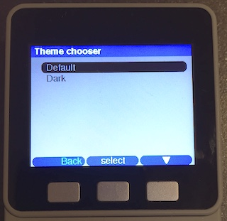 &nbsp;&nbsp;&nbsp; 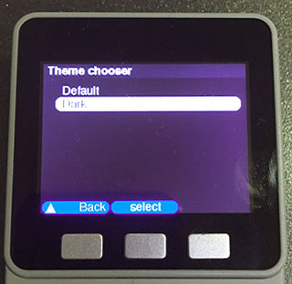

If you include no themes, the default theme is loaded as the only theme.

### Making your own

To make your own theme, copy the default theme from the src/themes directory to your sketch directory, rename it and change the values you want to change. The dark theme should give you an idea how to uncomment and change some of the values. Make sure you at least change the 'name' property as that will be displayed in the theme chooser. Now include this file in the `setup()` section of your sketch. Since you're including from the sketch directory and not from a library use quotes and not pointy brackets, like `#include "myTheme.h"`. If you spend some time to create a cool looking theme, please send it along so it can be included for everyone else to use.

&nbsp;

## z-sketches

With a simple trick, you can make code that does something pretty on its own, but that can also be included to provide a submenu in a bigger program. If you look at the M5ez-demo program, you will see that its directory includes another sketch named z-sysinfo.ino. This is the same z-sysinfo.ino that can be compiled on its own. (It is in the examples directory.)

Normally putting two .ino files in the same directory is a bad idea as the compiler then finds two programs that each have a `setup()` and a `loop()`. But if one of the programs (the "master" program) specifies `#define MAIN_DECLARED` and the slave program has `#ifndef MAIN_DECLARED` and `#endif` around its declaration of `setup()` and `loop()`, it no longer conflicts. This means the master program can call functions from it. As you can see z-sysinfo.ino also uses whether or not `MAIN_DECLARED` is defined to determine whether to provide an "Exit" button. After all: if it is running stand-alone there is nothing to exit to.

Also note that you do not need to `#include` any sketches placed in the same directory as your master program: the compiler combines them automatically. That also means you must ensure that no names are declared twice, or otherwise the compiler will complain.

> *It's called a z-sketch and starts with a z because that way the Arduino program that turns the .ino files into .cpp files for the compiler looks at it last, which is important. Silly hack, but it is nice to able to write smaller bits of functionality that can be shown and tested individually.*

&nbsp;

## Table of Contents

* [`M5ez` The easy way to program on the M5Stack](#m5ez-the-easy-way-to-program-on-the-m5stack)
  * [Introduction](#introduction)
    * [Other products by M5](#other-products-by-m5)
    * [Alternatives](#alternatives)
      * [UiFlow](#uiflow)
  * [Getting started](#getting-started)
    * [If you get `fatal error: ezTime.h: No such file or directory`](#if-you-get-fatal-error-eztimeh-no-such-file-or-directory)
  * [Structure of documentation](#structure-of-documentation)
    * [Tech Notes](#tech-notes)
* [M5ez User Manual](#m5ez-user-manual)
  * [How it all works](#how-it-all-works)
  * [Screen](#screen)
  * [Header](#header)
    * [Showing, hiding, title](#showing-hiding-title)
    * [Your own header widgets](#your-own-header-widgets)
  * [Canvas](#canvas)
    * [Canvas dimensions](#canvas-dimensions)
    * [Printing to the canvas](#printing-to-the-canvas)
  * [Buttons](#buttons)
  * [Scheduling tasks within M5ez](#scheduling-tasks-within-m5ez)
    * [Yield](#yield)
    * [Your own events](#your-own-events)
      * [Redrawing after an event](#redrawing-after-an-event)
  * [Showing messages with msgBox](#showing-messages-with-msgbox)
  * [ezProgressBar](#ezprogressbar)
  * [3-button text input](#3-button-text-input)
  * [FACES keyboard support](#faces-keyboard-support)
  * [Composing or viewing longer texts: textBox](#composing-or-viewing-longer-texts-textbox)
  * [Fonts](#fonts)
    * [FreeFonts from the Adafruit library](#freefonts-from-the-adafruit-library)
    * [FreeFonts included by the M5Stack driver](#freefonts-included-by-the-m5stack-driver)
    * [Older fonts available only through M5ez](#older-fonts-available-only-through-m5ez)
    * [Using your own fonts](#using-your-own-fonts)
  * [Menus](#menus)
    * [Let's start with text menus](#lets-start-with-text-menus)
    * [`.runOnce()`](#runonce)
    * [Image menus](#image-menus)
    * [Menus: all the functions documented](#menus-all-the-functions-documented)
  * [Settings](#settings)
    * [Wifi](#wifi)
      * [The weird Wifi ghost button problem](#the-weird-wifi-ghost-button-problem)
      * [Over-The-Air (OTA) updates via https](#over-the-air-ota-updates-via-https)
    * [BLE](#ble)
    * [Battery](#battery)
    * [Clock](#clock)
    * [Backlight](#backlight)
    * [FACES keyboard](#faces-keyboard)
    * [Factory defaults](#factory-defaults)
    * [Adding your own settings](#adding-your-own-settings)
  * [Themes](#themes)
    * [Including themes](#including-themes)
    * [Making your own](#making-your-own)
  * [z-sketches](#z-sketches)
* [Table of Contents](#table-of-contents)
